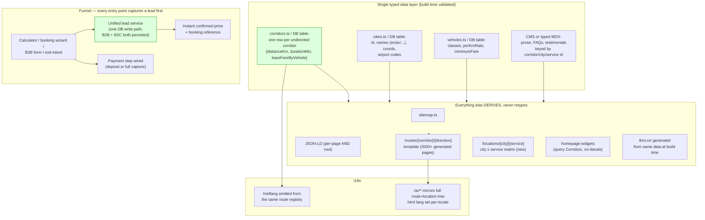

# 03 — Architecture

## Current state

```mermaid
flowchart TB
    subgraph Content["Content sources (10+ independent, hand-maintained)"]
        RD["lib/data/routes.ts\nROUTES_DATA (71 entries)"]
        RC["ROUTE_CONTENT in\nroutes/[slug]/page.tsx\n(hand prose per slug)"]
        HP1["home-page.tsx\nroute ticker array"]
        HP2["home-page.tsx\nUmrah card array"]
        LD["app/layout.tsx\nroot FAQPage JSON-LD"]
        SVC["service pages\n(3+ own route arrays)"]
        PRC["pricing/page.tsx\nFIXED_ROUTES"]
        LLMS["public/llms.txt\n(hand-written)"]
        STATS["lib/config/stats.ts\n(56+ route count)"]
    end

    subgraph DB["Postgres (Supabase-hosted)"]
        PRoute["Prisma: Route table\n(seeded from ROUTES_DATA,\ncan drift)"]
        PBooking["Prisma: Booking, Payment,\nUser, Driver, Vehicle,\nLead, NotificationFailure"]
        PFareRule["Prisma: FareRule\n(DORMANT - zero callers)"]
        SQuot["Supabase: quotations"]
        SDriv["Supabase: drivers"]
        SBook["Supabase: bookings\n(ORPHANED - unused)"]
    end

    subgraph PricingEngine["Pricing (2 layers)"]
        Quote["lib/pricing/quote.ts\nquote() - vehicle x distance x rules"]
        Fallback["api/pricing/route.ts\nGoogle Distance Matrix\nOR char-count fallback\n(no key configured)"]
    end

    subgraph Pages["Rendered pages"]
        RoutesHub["/routes hub\n(reads Prisma Route)"]
        RouteDetail["/routes/[slug]\n(SSG from ROUTES_DATA)"]
        Home["/ homepage\n(1671-line client component)"]
        LocPages["/locations/[city]\n(12 pages, static data)"]
        SvcPages["/services/*\n(19 hand-authored pages)"]
    end

    subgraph Funnel["Conversion funnel"]
        Calc["PriceCalculator\n(homepage widget)"]
        BookWiz["/book 6-step wizard"]
        WA["WhatsApp hand-off"]
        LeadsDB["Lead table\n(consumer only)"]
        Contact["/api/contact\nNO DB WRITE"]
        PayAPI["Payment APIs\n(built, NOT wired to any UI)"]
    end

    RD --> RC
    RD --> RoutesHub
    RD -.seed script.-> PRoute
    PRoute --> RoutesHub
    RD --> RouteDetail
    RC --> RouteDetail
    HP1 --> Home
    HP2 --> Home
    LD -.every page.-> Pages
    SVC --> SvcPages
    RD --> PRC --> Pages

    Calc --> Fallback
    Fallback --> Quote
    Quote -.does NOT read.-> PFareRule
    Calc -->|lead_captured| LeadsDB
    Calc --> WA
    BookWiz --> Fallback
    BookWiz -->|POST /api/bookings| PBooking
    BookWiz -.->|"share after confirm"| WA
    BookWiz -.NOT wired.-> PayAPI

    PartnersForm["/partners, CorporateAccountForm\n(B2B leads)"] --> Contact

    style HP1 fill:#fdd,stroke:#c00
    style HP2 fill:#fdd,stroke:#c00
    style LD fill:#fdd,stroke:#c00
    style RC fill:#fdd,stroke:#c00
    style PFareRule fill:#ddd,stroke:#888
    style SBook fill:#ddd,stroke:#888
    style Contact fill:#fdd,stroke:#c00
    style PayAPI fill:#ddd,stroke:#888
    style Fallback fill:#fdd,stroke:#c00
```

Red = actively contradicts another node with different numbers (data integrity findings P0-1 through P0-4, P0-9, P0-10). Grey = dead/dormant code (built but unused).

## Target state (10-year, 2,000+ page horizon)

## The delta

| Area | Current | Target | Why it matters at scale |
|---|---|---|---|
| Route facts | 10+ hand-maintained locations (§`01-INVENTORY.md` §3), one of which is a live Postgres table that can silently drift from the static array | One typed source (`Corridors`), everything else — pages, JSON-LD, sitemap, llms.txt, WhatsApp prefill — reads from it at build/request time | At 71 routes this is already causing visible contradictions; at 2,000+ routes across 6 languages, manual duplication becomes mathematically impossible to keep consistent (2,000 × 6 × N-hardcoded-locations = tens of thousands of hand-edits per price change) |
| Content | Prose (`ROUTE_CONTENT`, service page copy, testimonials) is hand-written per page in `.tsx` files, mixed with layout/JSX | Content separated into a typed data layer or lightweight CMS, keyed by entity id, with layout/JSX as pure presentation | 2,000+ pages of hand-authored `.tsx` content blocks is not maintainable by a small team; separating content from layout also unblocks 6-language translation without triplicating component code |
| Pricing | Two-and-a-half engines: `quote()` (the good one), a dormant `FareRule` DB table nothing reads, and a text-length fallback formula that fabricates distance | One engine (`quote()`), fed by real distance resolution (routed distance lookups keyed by corridor, with Google Maps as enrichment not the only source of truth), `FareRule` either wired to a real admin UI or deleted | Admin-editable pricing (via `FareRule` or equivalent) is required once there's a driver/partner network with route-specific costs — hardcoded TS constants don't scale to per-partner or per-season pricing |
| Backend | Prisma and Supabase both live against one DB with overlapping/orphaned tables (`public.bookings` unused, `leads` table written through both migration and Prisma mapping) | One ORM/client per table, documented; recommend consolidating on Prisma (already the majority pattern, has the NextAuth adapter, and Supabase's role narrows to just auth/storage if needed) | A driver/partner network adds `DriverPayout`, `PartnerAccount`, `DriverShift` etc. — that schema work should happen against one clear ORM boundary, not two |
| i18n | 6 of ~130 templates have Arabic; language switcher doesn't link to `/ar`; `<html lang>` hardcoded | Route/location templates parametrized by locale from the start (`/[locale]/routes/[slug]` or middleware-based locale resolution), hreflang generated from the same route registry that generates the pages | Retrofitting i18n onto 2,000 already-built English-only pages is far more expensive than building the locale parameter into the route template from the start |
| Booking funnel | Price calculator captures a lead only on WhatsApp click; B2B forms don't persist at all; payment is fully built but has zero UI entry point; no abandoned-quote recovery | Every entry point (calculator, wizard, B2B form, exit-intent) writes to one lead service immediately upon getting pickup+dropoff+contact info, independent of whether the user completes the flow | At current traffic this loses a handful of leads; at the target scale (driver/partner network, thousands of monthly quotes) this is the difference between a working sales pipeline and guessing |
| Components | Business-logic components (`PriceCalculator`, booking wizard) mixed with one-off, per-page marketing sections; three overlapping UI kits (`@radix-ui`, `@base-ui/react`, `shadcn`) | A small shared design-system layer (buttons, cards, form fields, fact tables — `DistanceTable.tsx` is already a good example of this pattern) reused across route/location/service templates instead of each page hand-rolling its own JSX | 2,000+ pages built from bespoke JSX per page (as service pages currently are) is not sustainable; templates + a shared primitive layer is |

## Migration risks

1. **Consolidating route data sources (P0-1..P0-4, P1-6) touches the highest-traffic pages.** Mitigate by doing it behind the existing static-generation boundary (`generateStaticParams` + ISR) so a bad data change is caught in a preview deploy before it's live, and by keeping the change mechanical (replace literals with lookups, don't redesign pages) in the first pass.
2. **Merging Prisma/Supabase usage risks breaking the live booking/quotation/driver-registration flows**, which currently work. Do this as a pure refactor (same DB, same tables, just one client library per table) with a full manual smoke-test of `/book`, `/api/quotations`, `/api/partners/driver` before/after — never as part of the same change that also touches pricing data.
3. **i18n expansion is a large content-production cost, not just an engineering one** — translating 71+ route pages and 12 location pages requires either real Arabic copywriting or a reviewed MT pipeline; budget this separately from the code work (parametrizing the route template for locale).
4. **Payment UI wiring (P0-7) changes what a booking "means"** — once a deposit can be charged, refund/cancellation policy, dispute handling, and the `NotificationFailure` fallback path all need to be re-verified end-to-end, not just the happy path.
5. **Any FareRule/admin-pricing UI work must not let admin-set prices and the static `ROUTES_DATA`/`quote()` engine coexist silently** — decide one direction (DB-backed prices win, or static wins) and delete the other, or repeat the exact P0-1..P0-4 duplication bug one layer down.

## What to keep untouched

- **`lib/schema.ts`** — the centralized JSON-LD builder pattern is correct, and the deliberate, commented removal of fake `aggregateRating`/`Review` markup (both here and in `app/layout.tsx:97-99`) is exactly the right call. Extend this pattern; don't replace it.
- **`lib/pricing/quote.ts`** — a clean, well-documented, pure pricing function with VAT as an explicit line item and no hidden globals. This is the right shape for the pricing engine; the problem is what feeds it (P0-2), not the function itself.
- **SSG + daily ISR on route/location/service pages** (`generateStaticParams` + `revalidate = 86400`) — fast, indexable, correct rendering strategy for content that changes infrequently. Keep this pattern for any new templates (city × service matrix, GCC expansion pages).
- **`components/seo/Breadcrumbs.tsx`, `RouteRelatedLinks.tsx`, `DistanceTable.tsx`, `JsonLd.tsx`** — genuinely algorithmic, reusable, server components with no client JS cost. `RouteRelatedLinks.tsx` in particular already does real cross-linking logic (reverse-route + shared-city matching) that should be the model for fixing `ServiceRelatedLinks.tsx` (P1-4).
- **301 redirect hygiene in `next.config.ts`** and the **`/ar` duplicate-content dedupe in `middleware.ts`** — both show real SEO discipline (retired driver-jobs pages redirected to relevant live pages instead of 404ing; non-existent Arabic paths redirect to English instead of serving thin/duplicate content).
- **`robots.txt`'s explicit AI-crawler allowlist + `public/llms.txt`** — ahead of most competitors in this niche on AI-answer-engine readiness; keep and expand (generate `llms.txt` from the same data source once consolidated, per the target-state diagram).
- **The `Lead`/`NotificationFailure` fallback pattern** (`prisma/schema.prisma:338-377`) — durable capture-before-handoff and a durable record of failed notifications is exactly the right pattern; the fix needed is applying it everywhere (B2B forms, exit-intent), not redesigning it.
- **`lib/config/credentials.ts`'s `hasCredential()` gating pattern** — the design intent ("never render a claim without the real number behind it") is exactly correct; the problem is that only one of ~6 call sites actually uses it (P0-5). Apply the existing pattern everywhere, don't invent a new one.
