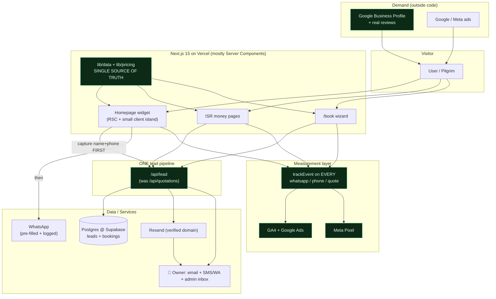

# 01 — Architecture

## 1. Stack detection (verified)

| Concern | What it is | Evidence |
|---|---|---|
| Framework | **Next.js `^15.3.2`**, **App Router** | [package.json:34](../../package.json#L34), `app/` dir with `layout.tsx`/`page.tsx` |
| UI runtime | **React 19** | [package.json:39‑41](../../package.json#L39) |
| Language | **TypeScript 5.8** | [package.json:66](../../package.json#L66) |
| Package manager | **npm** | `package-lock.json` present (508 KB) |
| Deploy target | **Vercel** | [vercel.json](../../vercel.json) `{"framework":"nextjs"}`, `@vercel/analytics` |
| Node version | **Unverified** — no `.nvmrc`, no `engines` field | (Vercel default; pin this) |
| Styling | **Tailwind v4** + shadcn + heavy inline styles | [package.json:56](../../package.json#L56), `components/ui/*` |
| Animation | **framer‑motion 12** (site‑wide) | [home-page.tsx:4](../../components/sections/home-page.tsx#L4) |
| ORM / DB | **Prisma 6 → Postgres** *and* **Supabase JS client** (same DB) | [lib/prisma.ts](../../lib/prisma.ts), [lib/supabase/*](../../lib/supabase/), [.env.local `DATABASE_URL`] |
| Auth | **NextAuth v4** (credentials + Prisma adapter) | [middleware.ts:3](../../middleware.ts#L3), [lib/auth.ts](../../lib/auth.ts) |
| Email | **Resend** (configured) | [lib/notifications.ts:1](../../lib/notifications.ts#L1) |
| SMS | **Twilio** (installed, **NOT configured** → simulated) | [notifications.ts:36](../../lib/notifications.ts#L36) |
| Payments | **Stripe / Moyasar / HyperPay** code exists, **none live** | `app/api/payments/*`, [book/page.tsx:112](../../app/book/page.tsx#L112) |
| Maps | **Google Maps JS + Distance Matrix** (key **not set** → fake distances) | [api/pricing/route.ts:57](../../app/api/pricing/route.ts#L57) |
| Analytics | **Vercel Analytics only** (no GA4/GTM/Pixel/Clarity) | [layout.tsx:7](../../app/layout.tsx#L7) |

## 2. Content & data location

**All content is hard‑coded in TypeScript** — no CMS, no MDX, no headless anything.

| Data | Where it lives | Type |
|---|---|---|
| Homepage copy (EN/AR/UR) | [home-page.tsx:29‑525](../../components/sections/home-page.tsx#L29) | Inline object in one client component |
| Routes (67) | [lib/data/routes.ts](../../lib/data/routes.ts) **and** DB `Route` table (seeded) | **Duplicated** static + DB |
| Prices | [lib/pricing.ts](../../lib/pricing.ts) (calc) + `routes.ts basePrice` + hard‑coded JSX | **3+ sources** (see [05](05-duplication-map.md)) |
| Fleet | [lib/fleet-data.ts](../../lib/fleet-data.ts), [lib/db.ts:14](../../lib/db.ts#L14) seed, [home-page.tsx:541](../../components/sections/home-page.tsx#L541), [book/page.tsx:60](../../app/book/page.tsx#L60), [lib/data/site.ts:19](../../lib/data/site.ts#L19) | **5 sources, inconsistent** |
| Cities / locations | [locations/[city]/page.tsx:59](../../app/(marketing)/locations/[city]/page.tsx#L59), [subareas.ts](../../lib/data/subareas.ts) | Inline record |
| Recovery cities (12) | [lib/data/recovery.ts](../../lib/data/recovery.ts) | Structured data file (good pattern) |
| Guides / blog | [lib/data/guides.ts](../../lib/data/guides.ts), [lib/data/blog-posts.ts](../../lib/data/blog-posts.ts) | Static + admin MD editor |
| FAQs | Repeated in [layout.tsx:136](../../app/layout.tsx#L136), [home-page.tsx:182](../../components/sections/home-page.tsx#L182), each city/route page | **Duplicated** |
| Contact / phone | [lib/config/contact.ts](../../lib/config/contact.ts) (SSOT) + hard‑coded copies | Mostly centralized |
| Reviews | **Fabricated**, hard‑coded [home-page.tsx:611](../../components/sections/home-page.tsx#L611), per‑city [locations/[city]/page.tsx:94](../../app/(marketing)/locations/[city]/page.tsx#L94) | Fake |

## 3. Backend inventory (does it exist?)

| Capability | Exists? | Notes |
|---|---|---|
| API routes | ✅ 40+ under `app/api/*` | bookings, quotations, pricing, contact, payments, drivers, admin |
| Database | ✅ Postgres (Supabase) | Accessed via **both** Prisma and Supabase SDK |
| ORM | ✅ Prisma 6 | plus raw Supabase RPC for quotations |
| Auth | ✅ NextAuth v4 | admin + customer roles, middleware‑guarded |
| Email | ✅ Resend | **but** `RESEND_FROM_EMAIL` unset → `onboarding@resend.dev` (test mode can only send to the account owner → **customer emails likely undelivered**) [notifications.ts:29](../../lib/notifications.ts#L29) |
| SMS | ⚠️ Twilio coded, **not configured** | all sends are `console.log` simulations [notifications.ts:67](../../lib/notifications.ts#L67) |
| WhatsApp | ⚠️ **Deep links only** (`wa.me`) — no Business API | 40+ links; no record captured |
| Payment gateway | ❌ **Not live** | Stripe/Moyasar/HyperPay routes exist but unconfigured; booking = cash on arrival [book/page.tsx:112](../../app/book/page.tsx#L112) |
| ZATCA e‑invoicing | ⚠️ Simulated | placeholder VAT number [zatca.ts:64](../../lib/zatca.ts#L64) |
| Lead notification (booking) | ❌ **Not wired** | `/api/bookings` never calls the notifier |
| Lead notification (quotation) | ✅ Wired | `/api/quotations` → Resend admin + customer |

## 4. Dependency flags

| Package | Flag | Why |
|---|---|---|
| `lucide-react ^1.16.0` | ⚠️ **Suspicious version** | lucide‑react's real line is `0.x`; `1.16.0` is unexpected — verify it resolved to the intended icon set. [package.json:33](../../package.json#L33) |
| `@base-ui/react` **+** `@radix-ui/*` **+** `shadcn` | 🟡 Duplicated purpose | Two+ headless‑UI primitive systems. Pick one. |
| `framer-motion` | 🟡 Oversized for use | Loaded on nearly every page for simple fades; heavy client JS. |
| `@uiw/react-md-editor`, `recharts`, `@react-pdf/renderer` | 🟡 Heavy, admin‑only | Fine **if** code‑split to admin routes; verify they're not in the public bundle. |
| `stripe`, `twilio`, `cloudinary`, `@googlemaps/js-api-loader` | 🟡 Installed, unused/unconfigured | Dead weight in `node_modules`; ship nothing but bloat install. |
| `@auth/prisma-adapter` **+** `@supabase/ssr` auth | 🟡 Two auth stacks | NextAuth *and* Supabase auth session sync in middleware. Consolidate. |
| `next-remove-imports` | ⚠️ Unmaintained | Legacy MD‑editor shim; check still needed. |

## 5. Route tree (render strategy)

Legend: **SSG** = static at build · **ISR** = static + revalidate · **CSR** = client‑rendered body · **SSR/Dyn** = per‑request · **noindex**

```
/                              CSR body + SSG shell   (HomePage is "use client")
/about /contact /faq /pricing  CSR + per-route metadata layout
/fleet  /fleet/[slug]          SSG (fleet-data)
/routes  /routes/[slug]        ISR 86400 · generateStaticParams (67)   ← money pages
/locations  /locations/[city]  ISR 86400 · SSG params (11)             ← money pages
/locations/[city]/[subarea]    ISR (33 subareas)
/airports/[slug]               SSG (8)   ⚠ orphaned (not in nav/footer)
/services  + 18 service pages   mostly CSR ("use client")
/services/car-recovery/[city]  ISR (12)                                ← money pages
/guides  /guides/[slug]        SSG
/blog  /blog/[slug]            SSG (published filter)
/book                          CSR wizard · noindex                    ← lead path (broken notify)
/track-booking                 CSR · noindex
/partners /partners/driver-registration  CSR (driver-registration noindex)
/ar, /ar/{about,contact,faq,pricing,partners}   SSR ⚠ lang="en" bug
/admin/* /customer/* /dashboard/*   SSR/Dyn · auth-guarded · no public chrome
/api/*                         SSR/Dyn
sitemap.xml  robots.txt  opengraph-image   generated
```

## 6. Current architecture (as‑is)

```mermaid
flowchart TD
    subgraph Visitor
      U[User / Pilgrim]
    end

    subgraph Next["Next.js 15 on Vercel"]
      HOME["Homepage widget<br/>PriceCalculator (CSR)"]
      BOOK["/book wizard (CSR)"]
      QFORMS["Recovery / Contact / Corporate forms"]
      MKTG["ISR money pages<br/>routes · locations · recovery"]
    end

    subgraph APIs["API routes"]
      PRICE["/api/pricing"]
      BOOKAPI["/api/bookings"]
      QUOTE["/api/quotations"]
      CONTACT["/api/contact"]
    end

    subgraph Data["Data / Services"]
      PG[("Postgres @ Supabase")]
      SUPA[("Supabase RPC<br/>quotations table")]
      RESEND["Resend email"]
      TW["Twilio SMS<br/>(NOT configured)"]
      GMAPS["Google Maps<br/>(key absent)"]
      WA["WhatsApp deep link"]
      OWNER["🧑 Business owner"]
    end

    U --> HOME & BOOK & QFORMS & MKTG
    HOME -->|price only| PRICE --> GMAPS
    HOME -->|hand-off, NO capture| WA
    MKTG -->|CTA| WA
    MKTG -->|CTA| BOOK
    BOOK --> BOOKAPI --> PG
    BOOKAPI -. "❌ no notification" .-> OWNER
    BOOK -. "fake 'SMS sent' logs" .-> U
    QFORMS --> QUOTE --> SUPA
    QUOTE --> RESEND --> OWNER
    CONTACT --> RESEND --> OWNER
    WA -. "manual chat, no record" .-> OWNER
    PRICE -. "fake distance if no key" .-> U

    classDef bad fill:#3a0d0d,stroke:#e15,color:#fee
    classDef ok fill:#0d2a16,stroke:#2a7,color:#dfe
    class BOOKAPI,WA,TW,GMAPS bad
    class QUOTE,CONTACT,RESEND ok
```



**The core architectural failure:** three parallel "book" funnels with three different behaviours. The two loudest ones (homepage widget → WhatsApp; `/book` → DB) don't reliably reach you. The one that works (`/api/quotations` → email) is only wired to the low‑traffic recovery/contact forms.

## 7. Proposed target architecture

Not a rewrite — a **consolidation**. One lead pipe, one price source, real measurement.



**Key moves:**
1. **Collapse three funnels into one `/api/lead`** — every widget, wizard step, and CTA captures name+phone to the DB and emails you *before* any WhatsApp handoff. Reuse the existing `/api/quotations` code.
2. **One price/data source** — `lib/data` + `lib/pricing` become authoritative; every page imports, nothing is retyped. Kill the DB/`routes.ts` duplication (pick one).
3. **Measurement layer** — GA4 + Meta Pixel + `trackEvent` on every WhatsApp/phone/quote interaction, so demand‑gen spend is attributable.
4. **Server‑first rendering** — homepage and static service pages become RSC with tiny client islands (the calculator, the language switcher). Cuts client JS dramatically.
5. **Verify Resend domain**, configure Twilio (or drop SMS honestly), and either make payments live or remove the payment claims.
6. **Demand generation** (GBP + ads) is drawn as a first‑class input because it is the actual growth lever.
