# 06 — Phased Execution Plan

Ordered by **ROI, not technical elegance**. Each phase is independently shippable and independently valuable. Effort is a solo‑developer estimate.

> **Guiding principle:** the site does not need a rewrite. Phases 1–5 are surgical fixes to existing, mostly‑good code. Phase 9 (demand generation) is where the lead count actually moves and is largely *outside* the codebase.

---

## Phase 0 — Triage (do today, ~1 hour)

**Goal:** find out if you already have unseen leads and stop obvious harm.
**Scope:** Query the `Booking` table (`db.booking.findMany`) and the Supabase `quotations` table for existing rows — these are real enquiries you may never have seen. Export contacts and follow up manually.
**Out of scope:** any code change.
**Files touched:** none (read‑only DB query / admin panel `/admin/quotations`).
**Acceptance:** you have a list of every lead captured to date and have contacted them.
**Rollback:** n/a.
**Effort:** 1 h.

---

## Phase 1 — Wire booking notifications (stop the silent lead loss)

**Goal:** every `/book` submission emails + SMSes you and the customer, using functions that already exist.
**Scope:** In `/api/bookings` POST, after `db.booking.create`, call `sendAdminNotification` and `sendBookingConfirmation` ([notifications.ts:110](../../lib/notifications.ts#L110),[:289](../../lib/notifications.ts#L289)). Fix the false "SMS confirmation sent" response ([api/bookings/route.ts:242](../../app/api/bookings/route.ts#L242)) and remove the fake client‑side "Twilio/Resend queued" logs ([book/page.tsx:369‑374](../../app/book/page.tsx#L369)). Correct "payment processed/(Paid)" copy on unpaid bookings ([notifications.ts:297](../../lib/notifications.ts#L297)).
**Out of scope:** payment gateway, SMS provider setup (email is enough for v1).
**Files touched:** [app/api/bookings/route.ts](../../app/api/bookings/route.ts), [app/book/page.tsx](../../app/book/page.tsx), [lib/notifications.ts](../../lib/notifications.ts).
**Acceptance:** a test booking produces a real admin email within seconds; confirmation UI reflects reality.
**Rollback:** revert the route change (booking still saves as before).
**Effort:** 3–4 h.

---

## Phase 2 — Capture the homepage lead before WhatsApp

**Goal:** the primary funnel stops leaking; every quote becomes a stored, notified lead.
**Scope:** Before the WhatsApp handoff in `PriceCalculator` ([:516](../../components/booking/PriceCalculator.tsx#L516)), add a minimal name+phone field that `POST`s to `/api/quotations` (which already stores + emails), then open WhatsApp pre‑filled with a lead reference. Do the same on route/location/service page CTAs. Mount the already‑built `BookingForm` (currently dead code) where a fuller form fits.
**Out of scope:** redesign of the calculator UI.
**Files touched:** [components/booking/PriceCalculator.tsx](../../components/booking/PriceCalculator.tsx), CTA sites in [home-page.tsx](../../components/sections/home-page.tsx), optionally mount [components/booking/booking-form.tsx](../../components/booking/booking-form.tsx).
**Acceptance:** completing a homepage quote creates a `quotations` row + admin email, then opens WhatsApp.
**Rollback:** feature‑flag the capture step; revert to direct WhatsApp link.
**Effort:** 6–8 h.

---

## Phase 3 — Measurement layer (make every future riyal accountable)

**Goal:** real attribution so Phase 9 spend is measurable.
**Scope:** Add GA4 + Meta Pixel (via `next/script` or GTM). Call `trackEvent`/GA events on **every** WhatsApp click (floating button [WhatsAppButton.tsx:93](../../components/shared/WhatsAppButton.tsx#L93), homepage, footer, all CTAs), **every** `tel:` click, and every quote/booking submit. Mark WhatsApp/phone/quote as conversions. Remove the fake "1" unread badge ([WhatsAppButton.tsx:103](../../components/shared/WhatsAppButton.tsx#L103)).
**Out of scope:** server‑side conversion API (later).
**Files touched:** [app/layout.tsx](../../app/layout.tsx), [components/shared/WhatsAppButton.tsx](../../components/shared/WhatsAppButton.tsx), [lib/analytics.ts](../../lib/analytics.ts), CTA components.
**Acceptance:** GA4 realtime shows `whatsapp_click`/`phone_click`/`quote_submitted`; Pixel fires.
**Rollback:** remove the scripts.
**Effort:** 4–6 h.

---

## Phase 4 — Trust & compliance pass

**Goal:** remove unbacked claims; show the real identifiers.
**Scope:** Remove "Ministry of Transport Certified" ([PriceCalculator.tsx:556](../../components/booking/PriceCalculator.tsx#L556)), "Google Review — Verified Trip" label + fake reviews ([home-page.tsx:165](../../components/sections/home-page.tsx#L165),[:611](../../components/sections/home-page.tsx#L611)), the "4.9/5" on city pages ([locations/[city]/page.tsx:737](../../app/(marketing)/locations/[city]/page.tsx#L737)), and the fake plate/stock‑photo in the driver email ([notifications.ts:193](../../lib/notifications.ts#L193),[:207](../../lib/notifications.ts#L207)). Soften "ZATCA compliant" → "ZATCA‑ready." Add CR, TGA licence, VAT number, registered trade name, visible address + landline to the footer, `/about`, `/contact`, Terms, Privacy, and the JSON‑LD. Name a legal entity in Terms/Privacy. Fix TLS/secret hygiene (remove `NODE_TLS_REJECT_UNAUTHORIZED`, rotate exposed keys, hash admin password).
**Out of scope:** obtaining the licences (business task, not code).
**Files touched:** [Footer.tsx](../../components/layout/Footer.tsx), [PriceCalculator.tsx](../../components/booking/PriceCalculator.tsx), [home-page.tsx](../../components/sections/home-page.tsx), [locations/[city]/page.tsx](../../app/(marketing)/locations/[city]/page.tsx), Terms/Privacy pages, [lib/schema.ts](../../lib/schema.ts), `.env.local`.
**Acceptance:** no claim on the site lacks a backing identifier; TLS verification on.
**Rollback:** per‑edit; low risk.
**Effort:** 1–1.5 days (code); licence numbers gated on you.

---

## Phase 5 — Single source of truth for price/distance/fleet

**Goal:** change one price in one place.
**Scope:** Make `lib/data/routes.ts` authoritative for `{distance,duration,basePrice}`; have `lib/pricing.ts` derive from it (delete `fixedRoutes`/`fixedRouteDetails` literals, de‑dup the copy in both API routes). Create one `FLEET` module consumed by homepage, `/book`, fleet pages, and the DB seed. Generate the homepage/location/route/JSON‑LD prices + FAQs from these sources. Compute stats ("56+ routes") from `ROUTES_DATA.length`. Fix the directional price bug ([routes.ts:88](../../lib/data/routes.ts#L88) vs [:308](../../lib/data/routes.ts#L308)) and decide whether routes live in code **or** the DB (not both).
**Out of scope:** changing the actual prices (business decision) — just unify them.
**Files touched:** [lib/pricing.ts](../../lib/pricing.ts), [lib/data/routes.ts](../../lib/data/routes.ts), [api/pricing/route.ts](../../app/api/pricing/route.ts), [api/bookings/route.ts](../../app/api/bookings/route.ts), fleet lists, [home-page.tsx](../../components/sections/home-page.tsx), [layout.tsx](../../app/layout.tsx). See [05-duplication-map.md](05-duplication-map.md).
**Acceptance:** grep proves each price/vehicle string appears once; calculator == advertised price.
**Rollback:** module‑by‑module; keep old constants until parity verified.
**Effort:** 2–3 days.

---

## Phase 6 — Shorten the funnel & fix the "instant" promise

**Goal:** fewer steps, honest messaging, working quotes.
**Scope:** Reduce `/book` from 6 steps to 3. Add the Google Maps key (or restrict the calculator to known routes) so distances/prices are real, not string‑length fakes ([api/pricing/route.ts:99](../../app/api/pricing/route.ts#L99)). Reconcile "Guaranteed Fixed Quote" vs "Estimated Fare" ([PriceCalculator.tsx:442](../../components/booking/PriceCalculator.tsx#L442),[:506](../../components/booking/PriceCalculator.tsx#L506)). Decide the confirmation promise: either make it genuinely instant, or replace "instant" language everywhere the "1–2 hours" reality applies.
**Out of scope:** payments.
**Files touched:** [app/book/page.tsx](../../app/book/page.tsx), [PriceCalculator.tsx](../../components/booking/PriceCalculator.tsx), [api/pricing/route.ts](../../app/api/pricing/route.ts), copy sites.
**Acceptance:** a real Maps‑backed price; consistent "estimate → we confirm" wording; ≤3 steps.
**Rollback:** revert wizard step config.
**Effort:** 1–2 days.

---

## Phase 7 — SEO cleanups

**Goal:** remove doorway risk, fix hreflang, tighten internal linking.
**Scope:** Fix `<html lang>`/`dir` per locale ([layout.tsx:222](../../app/layout.tsx#L222)). Consolidate/differentiate the hotel‑swap route cluster ([routes.ts:176](../../lib/data/routes.ts#L176), [02 §E1](02-seo-findings.md)). Add airports + missing cities to the footer ([Footer.tsx:53](../../components/layout/Footer.tsx#L53)). Derive sitemap lists from page data ([sitemap.ts:46](../../app/sitemap.ts#L46)). Add price to Service schema once unified. Trim keyword‑stuffed alts.
**Out of scope:** new content creation.
**Files touched:** [app/layout.tsx](../../app/layout.tsx), [lib/data/routes.ts](../../lib/data/routes.ts), [components/layout/Footer.tsx](../../components/layout/Footer.tsx), [app/sitemap.ts](../../app/sitemap.ts), [lib/schema.ts](../../lib/schema.ts).
**Acceptance:** Arabic pages `lang="ar" dir="rtl"`; no >70%‑duplicate route cluster; all money pages ≤2 clicks from home.
**Rollback:** per‑edit.
**Effort:** 1–2 days.

---

## Phase 8 — Performance, accessibility & i18n polish

**Goal:** faster mobile pages, keyboard‑accessible booking, correct RTL.
**Scope:** Convert the homepage and static service pages to Server Components with small client islands (calculator, language switcher); the 1,671‑line client homepage is the main offender ([home-page.tsx:1](../../components/sections/home-page.tsx#L1)). Code‑split admin‑only heavy libs (recharts, react‑pdf, md‑editor). Make booking vehicle cards real buttons ([book/page.tsx:775](../../app/book/page.tsx#L775)). Fix low‑contrast gold‑on‑white labels. Repair the mojibake Arabic strings in `/book` ([book/page.tsx:431](../../app/book/page.tsx#L431)) and externalize copy so new languages (ID/TR/MS) don't require touching dozens of components.
**Out of scope:** a full i18n framework migration (evaluate `next-intl` separately).
**Files touched:** [components/sections/home-page.tsx](../../components/sections/home-page.tsx), service pages, [app/book/page.tsx](../../app/book/page.tsx), UI components.
**Acceptance:** Lighthouse mobile perf ↑ and homepage client JS ↓ (measure before/after); axe shows keyboard‑operable booking; Arabic renders correctly RTL.
**Rollback:** per‑component.
**Effort:** 3–5 days.

---

## Phase 9 — Demand generation (the actual growth lever, mostly outside code)

**Goal:** get qualified humans onto the now‑instrumented, now‑trustworthy site.
**Scope:** Create & verify the **Google Business Profile** (map pack is where "airport taxi Jeddah" leads are); collect the first 10–20 **real** reviews; add the GBP URL to `sameAs` + footer. Launch a small, tightly‑geo‑targeted Google Ads + Meta campaign on high‑intent terms (airport transfer, Umrah taxi) now that Phase 3 makes it measurable. Build a few genuinely useful content assets (the guides system already exists).
**Out of scope:** most code (Phases 1–8 are prerequisites so the traffic converts and is measured).
**Files touched:** minimal ([lib/schema.ts](../../lib/schema.ts), [Footer.tsx](../../components/layout/Footer.tsx) for GBP link).
**Acceptance:** GBP verified & ranking locally; ads driving tracked conversions with a known cost‑per‑lead.
**Rollback:** pause campaigns.
**Effort:** ongoing; ~2–3 days setup + weekly management.

---

## Sequenced roadmap

```mermaid
gantt
    title Execution order (ROI-first)
    dateFormat X
    axisFormat %s
    section Week 1 (stop bleeding + see)
    P0 Triage DB              :0, 1
    P1 Booking notifications  :1, 4
    P2 Homepage lead capture  :4, 8
    P3 Measurement layer      :8, 6
    section Week 2 (trust + truth)
    P4 Trust & compliance     :14, 12
    P5 Single source of truth :26, 24
    section Week 3-4 (funnel + SEO)
    P6 Shorten funnel         :50, 16
    P7 SEO cleanups           :66, 16
    section Ongoing
    P8 Perf/A11y/i18n         :82, 40
    P9 Demand generation      :14, 120
```

Note P9 (demand gen) starts in parallel *after* Phase 3 gives you measurement — there's no point buying traffic you can't track.

---

## Appendix A — Performance findings (Step 6)

| Sev | Finding | Location |
|-----|---------|----------|
| 🟠 High | Homepage is one **1,671‑line client component** shipping all 3 languages of copy + framer‑motion to every visitor. | [home-page.tsx:1](../../components/sections/home-page.tsx#L1) |
| 🟠 High | **~63 files are `"use client"`**, including many static service pages that could be Server Components. | grep `"use client"` (63 files) |
| 🟡 Medium | `framer-motion` loaded on nearly every page for simple fades. | [home-page.tsx:4](../../components/sections/home-page.tsx#L4) |
| 🟡 Medium | Heavy libs (`recharts`, `@react-pdf/renderer`, `@uiw/react-md-editor`) — verify they're code‑split to admin routes and absent from the public bundle. | [package.json](../../package.json) |
| 🟡 Medium | 3 Google font families incl. Arabic **Cairo** loaded on English pages too. | [layout.tsx:24](../../app/layout.tsx#L24) |
| 🟢 Good | `next/image` with `priority`, `sizes`, `blurDataURL` throughout; only Unsplash allow‑listed. | [next.config.ts:76](../../next.config.ts#L76) |
| 🟢 Good | Money pages are SSG+ISR (`revalidate=86400`) — fast, cacheable. | [routes/[slug]/page.tsx:1](../../app/(marketing)/routes/[slug]/page.tsx#L1) |
| ⚠️ Unverified | Per‑route JS bundle sizes (no build run in this read‑only audit). Homepage is the likely >200 KB offender; **measure with `next build` + bundle analyzer** before/after Phase 8. | — |

## Appendix B — Accessibility findings (Step 6)

| Sev | Finding | Location |
|-----|---------|----------|
| 🟠 High | Booking vehicle **selection cards are `<article onClick>`** — not keyboard‑focusable/operable. | [book/page.tsx:775](../../app/book/page.tsx#L775) |
| 🟡 Medium | Add‑on option cards are clickable `
` — same keyboard issue. | [book/page.tsx:892](../../app/book/page.tsx#L892) |
| 🟡 Medium | Buttons restyle on `onMouseEnter/Leave` inline — no equivalent `:focus-visible` state (keyboard users get no visible focus). | [home-page.tsx:723‑730](../../components/sections/home-page.tsx#L723) |
| 🟡 Medium | Low contrast: gold `#C8A45D` small‑caps labels on white; footer text `rgba(255,255,255,0.5)` on dark green. | [PriceCalculator.tsx:228](../../components/booking/PriceCalculator.tsx#L228), [Footer.tsx:221](../../components/layout/Footer.tsx#L221) |
| 🟢 Good | Form inputs have `<label>`s; WhatsApp/social buttons have `aria-label`; decorative dots `aria-hidden`. | [book/page.tsx:498](../../app/book/page.tsx#L498), [WhatsAppButton.tsx:100](../../components/shared/WhatsAppButton.tsx#L100) |

## Appendix C — i18n readiness (Step 7)

| Sev | Finding | Location |
|-----|---------|----------|
| 🔴 Critical | `<html lang="en">` hard‑coded → `/ar` pages declare English, no document‑level `dir="rtl"`. | [layout.tsx:222](../../app/layout.tsx#L222) |
| 🔴 Critical | `/book` Arabic strings are **mojibake** (corrupted UTF‑8, e.g. `Ù¡. التÙاصيل`). | [book/page.tsx:431‑436](../../app/book/page.tsx#L431) |
| 🟠 High | **No externalized strings** — copy is inline per component (EN/AR/UR objects in [home-page.tsx:29](../../components/sections/home-page.tsx#L29), [Footer.tsx:7](../../components/layout/Footer.tsx#L7), ternaries in [book/page.tsx](../../app/book/page.tsx)). Adding ID/TR/MS means editing dozens of components. |
| 🟠 High | RTL handled ad‑hoc via `isRtl` conditionals, not a global `dir` switch → layout not reliably RTL‑safe. | throughout |
| 🟡 Medium | Prices differ by language (EN airport card 80/199, AR 199) — same duplication problem crossing locales. | [home-page.tsx:69](../../components/sections/home-page.tsx#L69) vs [:245](../../components/sections/home-page.tsx#L245) |
| 🟢 Good | `Cairo` Arabic font, `LanguageContext` + cookie, and middleware `/ar` dedupe already exist — the scaffolding is there. | [layout.tsx:24](../../app/layout.tsx#L24), [middleware.ts:61](../../middleware.ts#L61) |

**Effort to add Arabic (RTL) properly:** medium — fix `lang`/`dir`, repair encoding, and you have a working base (AR content already exists on 6 pages). **Effort to add Urdu/Indonesian/Turkish/Malay:** currently **high** because strings aren't externalized — first migrate copy into a resource system (e.g. `next-intl` message catalogs), then each new language is a translation file, not a code change.
